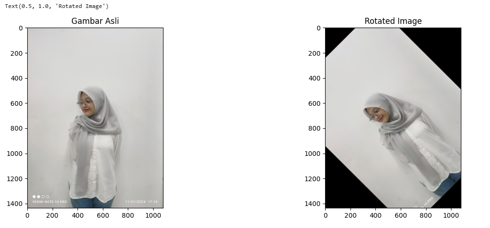

# PA-PC_202231029_ANNYDA-DYAH-KUSUMA_B
<br>
Nama  : Annyda Dyah Kusuma <br>
NIM   : 202231029 <br>
Kelas : B <br>
Ketentuan Project : Geommterix Citra <br>

---

## Tahapan dalam geometrix citra
Dalam mengerjakan project, saya melakukan beberapa hal :
- Mempersiapkan citra
- Melakukan rotasi gambar sebesar 45 derajat
- Meresize gambar
- Memotong (crop) sebagian gambar
- Membalik (flip) gambar secara horizontal
- Melakukan translasi gambar

---
Berikut adalah penjelasan lebih rinci terkait tahapan-tahapannya <br>
**Persiapan Citra** <br>
```
img = cv.imread('foto_diri.jpeg')
img.shape
img = cv.cvtColor(img, cv.COLOR_BGR2RGB)
rows,cols=img.shape[:2]
```
&nbsp;&nbsp;&nbsp;&nbsp;&nbsp;&nbsp;&nbsp;&nbsp;&nbsp;&nbsp;Kode di atas membaca gambar menggunakan fungsi cv.imread(). Fungsi ini mengambil file gambar 'foto_diri.jpeg' 
dan mengubahnya menjadi array NumPy tiga dimensi. Array ini merepresentasikan gambar dalam format BGR (Blue, Green, Red), 
yang merupakan standar OpenCV. Setiap piksel dalam gambar direpresentasikan oleh tiga nilai intensitas, masing-masing 
untuk kanal biru, hijau, dan merah, dengan rentang nilai 0-255 untuk gambar 8-bit. <br>

&nbsp;&nbsp;&nbsp;&nbsp;&nbsp;&nbsp;&nbsp;&nbsp;&nbsp;&nbsp;Setelah gambar dibaca, langkah selanjutnya adalah mengonversi ruang warna dari BGR ke RGB menggunakan fungsi cv.cvtColor(). 
Konversi ini penting karena meskipun OpenCV menggunakan format BGR, matplotlib - yang digunakan untuk menampilkan gambar - 
mengharapkan format RGB. Proses konversi ini pada dasarnya menukar posisi kanal biru dan merah dalam array gambar, 
memastikan bahwa warna ditampilkan dengan benar saat gambar divisualisasikan. <br>

&nbsp;&nbsp;&nbsp;&nbsp;&nbsp;&nbsp;&nbsp;&nbsp;&nbsp;&nbsp;Baris kode `rows,cols=img.shape[:2]` digunakan untuk mendapatkan jumlah baris (`rows`) dan kolom (`cols`) dari sebuah gambar 
(`img`). Perintah ini mengambil dimensi pertama dan kedua dari atribut `shape` objek gambar, yang mewakili tinggi dan lebar 
gambar tersebut. Dimensi ketiga (biasanya jumlah saluran warna) diabaikan karena hanya dimensi ruang yang dibutuhkan dalam konteks ini. <br>

&nbsp;&nbsp;&nbsp;&nbsp;&nbsp;&nbsp;&nbsp;&nbsp;&nbsp;&nbsp;&nbsp;&nbsp;&nbsp;&nbsp;&nbsp;&nbsp;&nbsp;&nbsp;&nbsp;&nbsp;


**Melakukan Rotasi Gambar** <br>
```
M=cv.getRotationMatrix2D(((cols-1)/2.0,(rows-1)/2.0),45,1)
rot=cv.warpAffine(img,M,(cols,rows))
```
&nbsp;&nbsp;&nbsp;&nbsp;&nbsp;&nbsp;&nbsp;&nbsp;&nbsp;&nbsp;Rotasi gambar melibatkan beberapa langkah. Pertama, titik pusat rotasi dihitung sebagai titik tengah gambar menggunakan rumus 
((cols-1)/2.0, (rows-1)/2.0). Kemudian, matriks rotasi 2D dibuat menggunakan cv.getRotationMatrix2D(), dengan sudut rotasi 45 derajat. 
Matriks ini mendefinisikan bagaimana setiap piksel akan dipindahkan untuk menciptakan efek rotasi. Akhirnya, rotasi diterapkan pada 
gambar menggunakan cv.warpAffine(), yang mengaplikasikan transformasi affine berdasarkan matriks rotasi yang telah dibuat. Proses ini 
menghasilkan gambar baru yang telah diputar sebesar 45 derajat searah jarum jam. <br>

Untuk menampilkan hasil rotasinya dan membandingkan dengan gambar asli bisa menggunakan plot.
```
fig, axs = plt.subplots(1,2, figsize=(15,5))
axs[0].imshow(img)
axs[0].set_title('Gambar Asli')
axs[1].imshow(rot)
axs[1].set_title('Rotated Image')
```
Output :<br>


&nbsp;&nbsp;&nbsp;&nbsp;&nbsp;&nbsp;&nbsp;&nbsp;&nbsp;&nbsp;&nbsp;&nbsp;&nbsp;&nbsp;&nbsp;&nbsp;&nbsp;&nbsp;&nbsp;&nbsp;

**Meresize Gambar** <br>
```
height, width = img.shape[:2]
res = cv.resize(img,(1*width, 2*height), interpolation = cv.INTER_CUBIC)
```
&nbsp;&nbsp;&nbsp;&nbsp;&nbsp;&nbsp;&nbsp;&nbsp;&nbsp;&nbsp;Baris kode `height,width=img.shape[:2]` digunakan untuk mendapatkan jumlah baris (`height`) dan kolom (`width`) dari sebuah gambar 
(`img`). Perintah ini mengambil dimensi pertama dan kedua dari atribut `shape` objek gambar, yang mewakili tinggi dan lebar 
gambar tersebut. Dimensi ketiga (biasanya jumlah saluran warna) diabaikan karena hanya dimensi ruang yang dibutuhkan dalam konteks ini. <br>

&nbsp;&nbsp;&nbsp;&nbsp;&nbsp;&nbsp;&nbsp;&nbsp;&nbsp;&nbsp;Proses merisize dilakukan menggunakan fungsi cv.resize(). Dalam kode ini, gambar diperbesar menjadi dua kali ukuran aslinya, 
baik lebar maupun tingginya. Metode interpolasi yang digunakan adalah interpolasi kubik (cv.INTER_CUBIC), yang melibatkan 16 
piksel terdekat untuk menghitung nilai setiap piksel baru. Metode ini menghasilkan hasil yang lebih halus dibandingkan dengan 
metode interpolasi yang lebih sederhana seperti nearest neighbor atau bilinear, terutama untuk pembesaran gambar. 
Berdasarkan kodingan tersebut maka, gambar diperbesar 2 kali lipat untuk tingginya dan tetap menggunakan lebar yang sebelumnya (1*width), hal ini dilakukan dengan
menggunakan cv.resize() dengan interpolasi cubic. <br>

Untuk menampilkan hasilnya dan membandingkan dengan gambar asli bisa menggunakan plot.
```
fig, axs = plt.subplots(1,2, figsize=(15,5))
axs[0].imshow(img)
axs[0].set_title('Gambar Asli')
axs[1].imshow(res)
axs[1].set_title('Resize Image')
```
Output :<br>

&nbsp;&nbsp;&nbsp;&nbsp;&nbsp;&nbsp;&nbsp;&nbsp;&nbsp;&nbsp;&nbsp;&nbsp;&nbsp;&nbsp;&nbsp;&nbsp;&nbsp;&nbsp;&nbsp;&nbsp;

**Memotong Gambar** <br>
```
crop = img[100:250, 280:430]
```
&nbsp;&nbsp;&nbsp;&nbsp;&nbsp;&nbsp;&nbsp;&nbsp;&nbsp;&nbsp;Operasi cropping dilakukan menggunakan teknik slicing array NumPy. Potongan gambar diambil dengan menentukan rentang indeks untuk 
baris dan kolom array gambar: img[100:250, 280:430]. Ini berarti mengambil bagian gambar dari baris 100 hingga 249 dan kolom 280 
hingga 429. Proses ini efektif mengekstrak area persegi panjang spesifik dari gambar asli, memungkinkan fokus pada region of interest 
tertentu untuk analisis atau pemrosesan lebih lanjut. <br>

Untuk menampilkan hasilnya dan membandingkan dengan gambar asli bisa menggunakan plot. <br>
```
fig, axs = plt.subplots(1,2, figsize=(15,5))
axs[0].imshow(img)
axs[0].set_title('Gambar Asli')
axs[1].imshow(crop)
axs[1].set_title('Cropped Image')
```
Output :<br>

&nbsp;&nbsp;&nbsp;&nbsp;&nbsp;&nbsp;&nbsp;&nbsp;&nbsp;&nbsp;&nbsp;&nbsp;&nbsp;&nbsp;&nbsp;&nbsp;&nbsp;&nbsp;&nbsp;&nbsp;

**Membalikkan Gambar** <br>
```
flip = cv.flip(img, 1)
```
&nbsp;&nbsp;&nbsp;&nbsp;&nbsp;&nbsp;&nbsp;&nbsp;&nbsp;&nbsp;Pembalikan gambar dilakukan menggunakan fungsi cv.flip(). Dengan parameter 1, fungsi ini membalik gambar secara horizontal, 
yang berarti menukar posisi piksel dari kiri ke kanan. Proses ini menciptakan efek cermin pada gambar, di mana sisi kiri gambar 
menjadi sisi kanan dan sebaliknya. Sedangkan jika ingin membalikkan secara vertikal, yang mana gambar awalnya menghadap bawah menjadi menghadap atas 
maka parameter yang diisikan adalah 0. <br>

Untuk menampilkan hasilnya dan membandingkan dengan gambar asli bisa menggunakan plot. <br>
```
fig, axs = plt.subplots(1,2, figsize=(15,5))
axs[0].imshow(img)
axs[0].set_title('Gambar Asli')
axs[1].imshow(flip)
axs[1].set_title('Flipped Image')
```
Output :<br>

&nbsp;&nbsp;&nbsp;&nbsp;&nbsp;&nbsp;&nbsp;&nbsp;&nbsp;&nbsp;&nbsp;&nbsp;&nbsp;&nbsp;&nbsp;&nbsp;&nbsp;&nbsp;&nbsp;&nbsp;

**Translasi Gambar** <br>
```
M = np.float32([[1,0,100],[0,1,100]])
trans=cv.warpAffine(img,M,(cols,rows))
```
&nbsp;&nbsp;&nbsp;&nbsp;&nbsp;&nbsp;&nbsp;&nbsp;&nbsp;&nbsp;Translasi gambar melibatkan pergeseran posisi setiap piksel dalam gambar. Proses dimulai dengan membuat matriks translasi menggunakan 
np.float32([[1,0,100],[0,1,100]]). Matriks ini mendefinisikan pergeseran 100 piksel ke kanan dan 100 piksel ke bawah. Kemudian, 
translasi diterapkan menggunakan cv.warpAffine(), yang mengaplikasikan transformasi affine berdasarkan matriks yang telah dibuat. 
Hasilnya adalah gambar yang telah digeser posisinya dalam bidang dua dimensi.

Untuk menampilkan hasilnya dan membandingkan dengan gambar asli bisa menggunakan plot. <br>
```
fig, axs = plt.subplots(1,2, figsize=(15,5))
axs[0].imshow(img)
axs[0].set_title('Gambar Asli')
axs[1].imshow(trans)
axs[1].set_title('Translated Image')
```
Output :<br>

&nbsp;&nbsp;&nbsp;&nbsp;&nbsp;&nbsp;&nbsp;&nbsp;&nbsp;&nbsp;&nbsp;&nbsp;&nbsp;&nbsp;&nbsp;&nbsp;&nbsp;&nbsp;&nbsp;&nbsp;

**Menampilkan Gambar Keseluruhan**
```
fig, axs = plt.subplots(2, 3, figsize=(15, 10))

axs[0, 0].imshow(img)
axs[0, 0].set_title('Gambar asli')

axs[0, 1].imshow(rot)
axs[0, 1].set_title('Rotation Image')

axs[0, 2].imshow(res)
axs[0, 2].set_title('Resized Image')

axs[1, 0].imshow(crop)
axs[1, 0].set_title('Cropped Image')

axs[1, 1].imshow(flip)
axs[1, 1].set_title('Flipped Image')

axs[1, 2].imshow(trans)
axs[1, 2].set_title('Translated Imgae')

plt.show()
```
&nbsp;&nbsp;&nbsp;&nbsp;&nbsp;&nbsp;&nbsp;&nbsp;&nbsp;&nbsp;Tahap akhir melibatkan visualisasi semua hasil operasi pengolahan citra menggunakan matplotlib. Sebuah figure dengan 
enam subplot dibuat, masing-masing menampilkan gambar asli dan hasil dari setiap operasi pengolahan (rotated, rezised, 
cropped, flipped, dan translated). Pengaturan ini memungkinkan perbandingan visual yang mudah antara gambar asli dan 
berbagai hasil transformasi. Setiap subplot diberi judul yang menjelaskan operasi yang dilakukan, memberikan representasi 
visual yang komprehensif dari seluruh proses pengolahan citra yang telah dilakukan.

Output :<br>

---
## Teori yang mendukung :
Dalam proses pengerjaan, berikut adalah beberapa teori yang mendukung dalam project : <br>

**1. Representasi Citra Digital <br>**
   &nbsp;&nbsp;&nbsp;&nbsp;&nbsp;&nbsp;&nbsp;&nbsp;&nbsp;&nbsp;Citra digital direpresentasikan sebagai matriks 2D untuk gambar
   grayscale atau 3D untuk gambar berwarna. Dalam kasus gambar berwarna, matriks 3D memiliki dimensi tinggi x lebar x 3
   (untuk channels R, G, B). Setiap elemen matriks, disebut piksel, memiliki nilai intensitas antara 0-255 untuk gambar 8-bit.
   Misalnya, [255, 0, 0] merepresentasikan warna merah murni.<br>
**2. Ruang Warna <br>**
   &nbsp;&nbsp;&nbsp;&nbsp;&nbsp;&nbsp;&nbsp;&nbsp;&nbsp;&nbsp;OpenCV menggunakan format BGR (Blue, Green, Red) secara default, sementara matplotlib menggunakan RGB. Konversi BGR ke RGB
   dilakukan dengan menukar channel pertama dan ketiga. Ruang warna lain seperti HSV, LAB juga ada, masing-masing memiliki
   kegunaan spesifik dalam pengolahan citra. <br>
**3. Transformasi Geometri <br>**
   **a. Rotasi <br>**
   
   &nbsp;&nbsp;&nbsp;&nbsp;&nbsp;&nbsp;&nbsp;&nbsp;&nbsp;&nbsp;Rotasi gambar melibatkan pemutaran setiap piksel mengelilingi titik pusat yang ditentukan. Matriks rotasi
2D [cos θ, -sin θ; sin θ, cos θ] digunakan untuk menghitung posisi baru setiap piksel. Dalam implementasinya, OpenCV menggunakan fungsi getRotationMatrix2D() untuk membuat matriks rotasi dan warpAffine() untuk menerapkan rotasi. Rotasi dapat menyebabkan sebagian gambar terpotong atau area kosong muncul di sudut-sudut, tergantung pada sudut rotasi. Proses rotasi melibatkan langkah-langkah berikut: <br>
   - Menentukan titik pusat rotasi (biasanya pusat gambar).
   - Menghitung matriks rotasi berdasarkan sudut θ yang diinginkan.
   - Untuk setiap piksel, menghitung posisi barunya menggunakan matriks rotasi.
   - Menginterpolasi nilai piksel jika posisi baru tidak tepat jatuh pada koordinat integer. <br>

   **b. Penskalaan (Resize)** <br>
   
   &nbsp;&nbsp;&nbsp;&nbsp;&nbsp;&nbsp;&nbsp;&nbsp;&nbsp;&nbsp;Penskalaan mengubah ukuran gambar dengan faktor tertentu. Ini melibatkan perubahan jumlah piksel dalam gambar. Proses penskalaan meliputi: <br>
   - Menentukan faktor skala (misalnya, 2 untuk memperbesar dua kali lipat).
   - Menghitung dimensi baru gambar berdasarkan faktor skala.
   - Untuk setiap piksel dalam gambar baru, menentukan piksel mana dari gambar asli yang sesuai.
   - Menggunakan teknik interpolasi untuk menghitung nilai piksel baru jika tidak ada korespondensi satu-ke-satu. <br>
      
   &nbsp;&nbsp;&nbsp;&nbsp;&nbsp;&nbsp;&nbsp;&nbsp;&nbsp;&nbsp;Metode interpolasi yang umum digunakan termasuk nearest neighbor (paling cepat tapi kasar),
bilinear (lebih halus), dan bicubic (paling halus tapi paling lambat). OpenCV menyediakan fungsi resize() untuk melakukan penskalaan dengan berbagai metode interpolasi.<br>

   **c. Cropping** <br>
   &nbsp;&nbsp;&nbsp;&nbsp;&nbsp;&nbsp;&nbsp;&nbsp;&nbsp;&nbsp;Cropping adalah proses memotong sebagian dari gambar untuk mendapatkan area yang diinginkan.
   Proses cropping ini melibatkan: <br>

   - Penentuan koordinat:

      - Baris mulai dari 100 hingga 249 (250 tidak termasuk)
      - Kolom mulai dari 280 hingga 429 (430 tidak termasuk)

   - Slicing array: Menggunakan notasi slicing NumPy untuk mengekstrak bagian yang diinginkan dari array gambar.
   - Hasil: Sebuah sub-array yang merepresentasikan bagian yang dipotong dari gambar asli. <br>
   
   &nbsp;&nbsp;&nbsp;&nbsp;&nbsp;&nbsp;&nbsp;&nbsp;&nbsp;&nbsp;Cropping berguna untuk berbagai tujuan, termasuk fokus pada area tertentu dalam gambar, menghilangkan bagian yang tidak diinginkan, mengubah aspek rasio gambar, dan mempersiapkan data untuk analisis spesifik. <br>
   &nbsp;&nbsp;&nbsp;&nbsp;&nbsp;&nbsp;&nbsp;&nbsp;&nbsp;&nbsp;Dalam konteks pengolahan citra, cropping termasuk dalam kategori transformasi geometri, meskipun lebih sederhana dibandingkan rotasi atau penskalaan. Cropping tidak mengubah nilai piksel, hanya mengekstrak subset dari piksel yang ada.

   **d. Flipping** <br>
   &nbsp;&nbsp;&nbsp;&nbsp;&nbsp;&nbsp;&nbsp;&nbsp;&nbsp;&nbsp;Flipping membalik gambar secara horizontal, vertikal, atau keduanya. Jenis-jenis flipping: <br>
   - Horizontal flip: Membalik gambar dari kiri ke kanan.
   - Vertical flip: Membalik gambar dari atas ke bawah.
   - Horizontal dan vertical flip: Kombinasi keduanya, setara dengan rotasi 180 derajat. <br>
      
   &nbsp;&nbsp;&nbsp;&nbsp;&nbsp;&nbsp;&nbsp;&nbsp;&nbsp;&nbsp;Proses flipping melibatkan: <br>
   - Menentukan jenis flip (horizontal, vertical, atau keduanya).
   - Untuk setiap piksel, menghitung posisi barunya berdasarkan jenis flip.
   - Menyalin nilai piksel ke posisi baru dalam gambar hasil. <br>
        
   &nbsp;&nbsp;&nbsp;&nbsp;&nbsp;&nbsp;&nbsp;&nbsp;&nbsp;&nbsp;OpenCV menyediakan fungsi flip() yang memudahkan operasi ini.
Flipping sering digunakan dalam augmentasi data untuk machine learning atau untuk mengoreksi orientasi gambar. 
Setiap transformasi geometri ini memiliki aplikasi spesifik dalam pengolahan citra dan dapat dikombinasikan untuk mencapai 
efek yang lebih kompleks. Pemahaman mendalam tentang cara kerja setiap transformasi memungkinkan penggunaan yang lebih efektif 
dalam berbagai tugas pengolahan citra.

   **e. Translasi** <br>
   &nbsp;&nbsp;&nbsp;&nbsp;&nbsp;&nbsp;&nbsp;&nbsp;&nbsp;&nbsp;Translasi melibatkan pergeseran setiap piksel dalam gambar
dengan jarak tertentu secara horizontal dan/atau vertikal. Proses translasi meliputi: <br>
   - Menentukan jumlah piksel untuk pergeseran horizontal (tx) dan vertikal (ty).
   - Membuat matriks translasi [1, 0, tx; 0, 1, ty].
   - Menerapkan matriks translasi ke setiap piksel dalam gambar.
        
   Matriks translasi [1, 0, tx; 0, 1, ty] bekerja dengan cara: <br>
   - Koordinat x baru = x lama + tx
   - Koordinat y baru = y lama + ty
        
   &nbsp;&nbsp;&nbsp;&nbsp;&nbsp;&nbsp;&nbsp;&nbsp;&nbsp;&nbsp;OpenCV menggunakan fungsi warpAffine() untuk menerapkan translasi. 
Translasi dapat menyebabkan sebagian gambar keluar dari batas atau menciptakan area kosong, tergantung pada arah dan besarnya pergeseran. <br>
